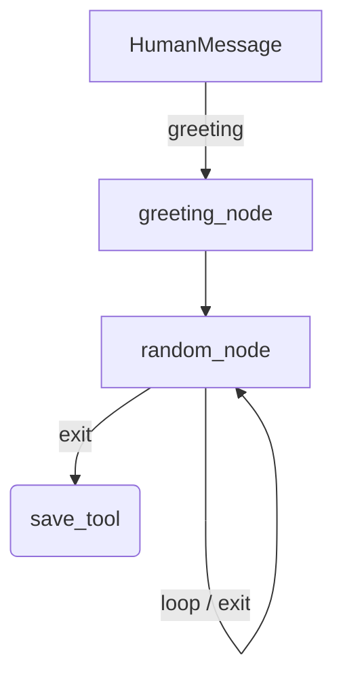

# LangGraph Document Drafter

A **multi‑node conversational agent** built with **[LangGraph](https://github.com/langchain-ai/langgraph)**.  It routes user messages through custom tools, maintains a shared document state, and finally exports the content as a version‑controlled text file — perfect for building quick notes, drafts, or AI‑generated documents.

---

## ✨ Key Features

* **Graph‑based Orchestration** – Nodes declared with `StateGraph` handle greeting, editing, saving, and exit flows.
* **Custom Tools** – `update()` appends or rewrites the live document, while `save()` persists it to disk.
* **Version‑Controlled Output** – Each saved draft is timestamped so you can track revisions.
* **Pluggable LLM** – Works with OpenAI, Ollama, or any LangChain‑compatible chat model.
* **CLI & GUI Ready** – Start from the terminal or embed the graph in a Tkinter/PyQt GUI.

---

## 🏗 Architecture



*Mermaid sketch – replace with `app.get_graph().draw_mermaid_png()` for an auto‑generated diagram.*

---

## 📦 Installation

```bash
git clone https://github.com/your‑username/langgraph‑drafter.git
cd langgraph‑drafter
python -m venv .venv
source .venv/bin/activate  # On Windows: .venv\Scripts\activate
pip install -r requirements.txt
```

> **Requires Python 3.9+**

---

## 🚀 Quick Start

```bash
python DRAFTER.py
```

```
===== DRAFTER =====
What would you like to do with the document? write me a poem about my friends mom
🤖 AI: …
```

The agent will chat, update the in‑memory document, and prompt you to **save** once you’re happy.

### Environment Variables

| Variable     | Purpose                           | Default     |
| ------------ | --------------------------------- | ----------- |
| `LLM_MODEL`  | Model alias for ChatOllama/OpenAI | `llama3`    |
| `NOTES_FILE` | Target text file for `save()`     | `notes.txt` |

---


